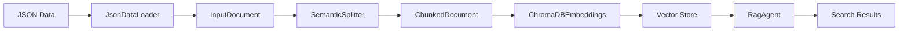

# Vector Database Guide

This guide demonstrates how to create vector databases from any JSON dataset using Buttermilk's ChromaDB integration and generic RAG agents.

## Overview

Buttermilk provides a complete pipeline for creating and using vector databases:

1. **Data Loading**: Load JSON data using flexible field mapping
2. **Text Processing**: Chunk documents for optimal embedding
3. **Embedding Generation**: Create vector embeddings using Vertex AI models
4. **Vector Storage**: Store embeddings in ChromaDB with metadata
5. **Semantic Search**: Query the vector database using natural language
6. **RAG Integration**: Use generic RAG agents for question answering

## Quick Start

### 1. Configuration Setup

Create a data configuration file (e.g., `conf/data/my_dataset.yaml`):

```yaml
my_data_json:
  type: json
  uri: gs://my-bucket/my-data.json
  field_mapping:
    record_id: id
    content: text_field
    metadata: 
      title: title
      category: category

my_data_vector:
  type: chromadb
  persist_directory: "gs://my-bucket/chromadb"
  collection_name: "my_collection"
  embedding_model: "text-embedding-005"
  dimensionality: 768
  arrow_save_dir: "/tmp/embeddings"
```

### 2. Create Vectorization Configuration

Create a run configuration file (e.g., `conf/run/my_vectorize.yaml`):

```yaml
# @package _global_

defaults:
  - _self_

name: my_vectorizer
job: my_processing

vectoriser:
  _target_: buttermilk.data.vector.ChromaDBEmbeddings
  persist_directory: "gs://my-bucket/chromadb"
  collection_name: "my_collection"
  embedding_model: "text-embedding-005"
  dimensionality: 768
  concurrency: 20
  upsert_batch_size: 50

chunker:
  _target_: buttermilk.data.vector.SemanticSplitter
  chunk_size: 4000
  chunk_overlap: 1000

input_docs:
  _target_: buttermilk.data.loaders.json_loader.JsonDataLoader
  uri: "gs://my-bucket/my-data.json"
  field_mapping:
    record_id: id
    content: text_field
    metadata:
      title: title
      category: category
```

### 3. Run Vectorization

```bash
uv run python -m buttermilk.data.vector run=my_vectorize
```

### 4. Create RAG Flow

Create a flow configuration (e.g., `conf/flows/my_rag.yaml`):

```yaml
defaults:
  - _self_
  - /data: my_dataset
  - /agents@agents.rag_agent: rag_generic
  - /agents@observers.host_ra: host/ra

orchestrator: buttermilk.orchestrators.groupchat.AutogenOrchestrator
description: My Dataset Research Assistant
parameters: {}
```

### 5. Start Interactive Chat

```bash
uv run python -m buttermilk.runner.cli +flow=my_rag run=api
```

## Architecture

### Components

#### 1. ChromaDBEmbeddings
- **Purpose**: Core vector database management
- **Features**: Embedding generation, ChromaDB integration, GCS support
- **Configuration**: Model selection, chunking parameters, storage paths

#### 2. RagAgent
- **Purpose**: Generic RAG functionality for any vector database
- **Features**: Semantic search, result filtering, LLM integration
- **Inheritance**: Base class for specialized agents like RagZot

#### 3. Data Loaders
- **JsonDataLoader**: Flexible JSON data loading with field mapping
- **Support**: Local files, GCS URIs, streaming for large datasets
- **Mapping**: Configurable field mapping for any JSON structure

#### 4. Text Processing
- **SemanticSplitter**: Intelligent document chunking
- **Configuration**: Chunk size, overlap, splitting strategies
- **Preservation**: Metadata and document relationships

### Data Flow


