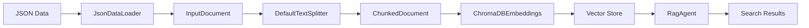

# Vector Database Guide

This guide demonstrates how to create vector databases from any JSON dataset using Buttermilk's ChromaDB integration and generic RAG agents.

## Overview

Buttermilk provides a complete pipeline for creating and using vector databases:

1. **Data Loading**: Load JSON data using flexible field mapping
2. **Text Processing**: Chunk documents for optimal embedding
3. **Embedding Generation**: Create vector embeddings using Vertex AI models
4. **Vector Storage**: Store embeddings in ChromaDB with metadata
5. **Semantic Search**: Query the vector database using natural language
6. **RAG Integration**: Use generic RAG agents for question answering

## Quick Start

### 1. Configuration Setup

Create a data configuration file (e.g., `conf/data/my_dataset.yaml`):

```yaml
my_data_json:
  type: json
  uri: gs://my-bucket/my-data.json
  field_mapping:
    record_id: id
    content: text_field
    metadata: 
      title: title
      category: category

my_data_vector:
  type: chromadb
  persist_directory: "gs://my-bucket/chromadb"
  collection_name: "my_collection"
  embedding_model: "text-embedding-005"
  dimensionality: 768
  arrow_save_dir: "/tmp/embeddings"
```

### 2. Create Vectorization Configuration

Create a run configuration file (e.g., `conf/run/my_vectorize.yaml`):

```yaml
# @package _global_

defaults:
  - _self_

name: my_vectorizer
job: my_processing

vectoriser:
  _target_: buttermilk.data.vector.ChromaDBEmbeddings
  persist_directory: "gs://my-bucket/chromadb"
  collection_name: "my_collection"
  embedding_model: "text-embedding-005"
  dimensionality: 768
  concurrency: 20
  upsert_batch_size: 50

chunker:
  _target_: buttermilk.data.vector.DefaultTextSplitter
  chunk_size: 4000
  chunk_overlap: 1000

input_docs:
  _target_: buttermilk.data.loaders.json_loader.JsonDataLoader
  uri: "gs://my-bucket/my-data.json"
  field_mapping:
    record_id: id
    content: text_field
    metadata:
      title: title
      category: category
```

### 3. Run Vectorization

```bash
uv run python -m buttermilk.data.vector +run=my_vectorize
```

### 4. Create RAG Flow

Create a flow configuration (e.g., `conf/flows/my_rag.yaml`):

```yaml
defaults:
  - _self_
  - /data: my_dataset
  - /agents@agents.rag_agent: rag_generic
  - /agents@observers.host_ra: host/ra

orchestrator: buttermilk.orchestrators.groupchat.AutogenOrchestrator
description: My Dataset Research Assistant
parameters: {}
```

### 5. Start Interactive Chat

```bash
uv run python -m buttermilk.runner.cli +flow=my_rag +run=api
```

## Architecture

### Components

#### 1. ChromaDBEmbeddings
- **Purpose**: Core vector database management
- **Features**: Embedding generation, ChromaDB integration, GCS support
- **Configuration**: Model selection, chunking parameters, storage paths

#### 2. RagAgent
- **Purpose**: Generic RAG functionality for any vector database
- **Features**: Semantic search, result filtering, LLM integration
- **Inheritance**: Base class for specialized agents like RagZot

#### 3. Data Loaders
- **JsonDataLoader**: Flexible JSON data loading with field mapping
- **Support**: Local files, GCS URIs, streaming for large datasets
- **Mapping**: Configurable field mapping for any JSON structure

#### 4. Text Processing
- **DefaultTextSplitter**: Intelligent document chunking
- **Configuration**: Chunk size, overlap, splitting strategies
- **Preservation**: Metadata and document relationships

### Data Flow



## Configuration Reference

### Data Source Configuration

```yaml
# JSON data source
dataset_json:
  type: json
  uri: gs://bucket/data.json           # Local path or GCS URI
  field_mapping:                       # Map JSON fields to Buttermilk schema
    record_id: id                      # Unique identifier field
    content: text                      # Main text content field
    metadata:                          # Additional metadata fields
      title: title
      author: author
      date: published_date
      tags: categories
```

### Vector Store Configuration

```yaml
# ChromaDB vector store
dataset_vector:
  type: chromadb
  persist_directory: gs://bucket/chromadb  # Storage location
  collection_name: my_collection           # ChromaDB collection name
  embedding_model: text-embedding-005      # Vertex AI embedding model
  dimensionality: 768                      # Embedding dimensions
  arrow_save_dir: /tmp/embeddings          # Local embedding cache
  concurrency: 20                          # Parallel processing
  upsert_batch_size: 50                    # Batch size for uploads
```

### Text Processing Configuration

```yaml
# Document chunking
chunker:
  _target_: buttermilk.data.vector.DefaultTextSplitter
  chunk_size: 4000        # Maximum chunk size in characters
  chunk_overlap: 1000     # Overlap between chunks
```

### RAG Agent Configuration

```yaml
# Generic RAG agent
researcher:
  role: RESEARCHER
  agent_obj: RagAgent
  description: Research assistant with vector knowledge base
  data: ${...data}                    # Reference to data configuration
  variants:
    model: ${llms.general}            # LLM model for synthesis
  parameters:
    template: rag_research            # Prompt template
    n_results: 20                     # Number of search results
    no_duplicates: false              # Filter duplicate documents
    max_queries: 5                    # Maximum concurrent queries
```

## Data Format Support

### JSON Structure Examples

#### Simple JSON
```json
{
  "id": "doc1",
  "title": "Example Document",
  "text": "Document content here...",
  "category": "research"
}
```

#### Nested JSON
```json
{
  "document": {
    "id": "doc1",
    "metadata": {
      "title": "Example Document",
      "author": "John Doe"
    },
    "content": {
      "body": "Document content here...",
      "summary": "Brief summary..."
    }
  }
}
```

#### JSON Lines (JSONL)
```jsonl
{"id": "doc1", "title": "Doc 1", "text": "Content 1..."}
{"id": "doc2", "title": "Doc 2", "text": "Content 2..."}
```

### Field Mapping

Map any JSON structure to Buttermilk's schema:

```yaml
field_mapping:
  record_id: document.id                    # Nested field access
  content: document.content.body            # Deep nesting support
  metadata:                                 # Flatten metadata
    title: document.metadata.title
    author: document.metadata.author
    summary: document.content.summary
    category: document.category
```

## Embedding Models

### Supported Models

| Model | Dimensions | Use Case |
|-------|------------|----------|
| text-embedding-004 | 768 | General purpose, cost-effective |
| text-embedding-005 | 768 | Latest model, improved quality |
| text-embedding-large-exp-03-07 | 3072 | High-dimensional, research use |

### Model Selection Guidelines

- **text-embedding-005**: Recommended for most use cases
- **text-embedding-004**: Cost-sensitive applications
- **text-embedding-large**: High-precision research applications

## Chunking Strategies

### Default Strategy
- **Chunk Size**: 4000 characters
- **Overlap**: 1000 characters
- **Method**: Recursive character splitting

### Custom Strategies

```yaml
# Precise chunking for structured documents
chunker:
  chunk_size: 2000
  chunk_overlap: 500

# Large chunks for long-form content
chunker:
  chunk_size: 8000
  chunk_overlap: 2000

# Minimal overlap for distinct sections
chunker:
  chunk_size: 3000
  chunk_overlap: 200
```

## Storage Options

### Local Development
```yaml
persist_directory: "./data/chromadb"
arrow_save_dir: "./data/embeddings"
```

### Production (GCS)
```yaml
persist_directory: "gs://my-bucket/chromadb"
arrow_save_dir: "/tmp/embeddings"  # Local cache
```

### Performance Tuning
```yaml
concurrency: 20          # Parallel embedding generation
upsert_batch_size: 50    # ChromaDB batch size
embedding_batch_size: 5  # Vertex AI batch size
```

## Search and Retrieval

### Basic Search
```python
# Using RAG agent
results = await rag_agent.fetch(["my search query"])

# Direct ChromaDB query
results = collection.query(
    query_texts=["my search query"],
    n_results=10,
    include=["documents", "metadatas"]
)
```

### Advanced Search with Filtering
```python
# Search within specific categories
results = collection.query(
    query_texts=["search query"],
    where={"category": "research"},
    n_results=5
)

# Metadata-based filtering
results = collection.query(
    query_texts=["search query"],
    where={"author": {"$eq": "John Doe"}},
    n_results=10
)
```

### Search Optimization

#### Relevance Tuning
```yaml
# RAG agent parameters
n_results: 20              # More results for better context
no_duplicates: true        # Remove duplicate documents
max_queries: 3             # Limit concurrent queries
```

#### Performance Optimization
```python
# Batch queries for efficiency
queries = ["query1", "query2", "query3"]
results = await rag_agent.fetch(queries)

# Use metadata filters to reduce search space
results = collection.query(
    query_texts=["query"],
    where={"date": {"$gte": "2024-01-01"}},
    n_results=5
)
```

## Integration Patterns

### Flow Integration

#### Simple Research Flow
```yaml
defaults:
  - /data: my_dataset
  - /agents@agents.researcher: rag_generic

orchestrator: buttermilk.orchestrators.groupchat.AutogenOrchestrator
```

#### Multi-Agent Flow
```yaml
defaults:
  - /data: my_dataset
  - /agents@agents.researcher: rag_generic
  - /agents@agents.analyst: analyst
  - /agents@observers.host: host/sequencer

orchestrator: buttermilk.orchestrators.groupchat.AutogenOrchestrator
```

### API Integration

```python
from buttermilk.agents.rag.rag_agent import RagAgent
from buttermilk._core.config import DataSourceConfig

# Create vector store configuration
vector_config = DataSourceConfig(
    type="chromadb",
    persist_directory="gs://bucket/chromadb",
    collection_name="my_collection"
)

# Initialize RAG agent
agent = RagAgent(
    data={"vector": vector_config},
    n_results=10,
    max_queries=3
)

# Search the knowledge base
results = await agent.fetch(["search query"])
```

## Best Practices

### Data Preparation
1. **Clean Text**: Remove formatting artifacts and normalize text
2. **Consistent Metadata**: Use standardized metadata fields
3. **Unique IDs**: Ensure record IDs are unique and stable
4. **Reasonable Size**: Chunk documents to 2000-8000 characters

### Performance
1. **Batch Processing**: Process large datasets in batches
2. **Parallel Embedding**: Use appropriate concurrency settings
3. **Caching**: Leverage local caching for remote storage
4. **Monitoring**: Track embedding costs and query performance

### Security
1. **Access Control**: Secure GCS buckets with proper IAM
2. **Data Privacy**: Audit metadata for sensitive information
3. **Encryption**: Use encrypted storage for sensitive data
4. **Logging**: Monitor vector store access patterns

### Maintenance
1. **Version Control**: Track embedding model versions
2. **Backup Strategy**: Regular backups of vector stores
3. **Index Updates**: Plan for data updates and reindexing
4. **Quality Monitoring**: Regular assessment of search quality

## Troubleshooting

### Common Issues

#### Embedding Generation Fails
```
Error: Failed to generate embeddings
```
**Solutions**:
- Check Vertex AI credentials and quotas
- Verify embedding model availability
- Reduce batch size if hitting rate limits

#### ChromaDB Connection Issues
```
Error: ChromaDB collection not found
```
**Solutions**:
- Verify persist_directory path and permissions
- Check collection_name configuration
- Ensure ChromaDB cache is initialized for remote storage

#### Memory Issues
```
Error: Out of memory during processing
```
**Solutions**:
- Reduce chunk_size and concurrency
- Process data in smaller batches
- Use streaming for large datasets

#### Poor Search Quality
**Symptoms**: Irrelevant search results
**Solutions**:
- Tune chunk_size for your content type
- Experiment with different embedding models
- Add metadata filters for better precision
- Increase n_results for more context

### Performance Optimization

#### Embedding Generation
- Use appropriate concurrency based on quotas
- Batch documents to reduce API calls
- Cache embeddings to avoid regeneration

#### Query Performance
- Use metadata filters to reduce search space
- Implement result caching for common queries
- Optimize chunk size for your use case

#### Storage Optimization
- Use GCS for production deployments
- Implement data retention policies
- Monitor storage costs and usage

## Examples

### Research Papers Dataset
```yaml
# papers.yaml
papers_json:
  type: json
  uri: gs://research/papers.json
  field_mapping:
    record_id: paper_id
    content: abstract
    metadata:
      title: title
      authors: authors
      journal: journal
      year: publication_year

papers_vector:
  type: chromadb
  persist_directory: gs://research/papers_chromadb
  collection_name: research_papers
  embedding_model: text-embedding-005
  chunk_size: 2000  # Smaller chunks for abstracts
```

### News Articles Dataset
```yaml
# news.yaml
news_json:
  type: json
  uri: gs://news/articles.jsonl
  field_mapping:
    record_id: article_id
    content: content
    metadata:
      title: headline
      source: source
      category: section
      date: published_date

news_vector:
  type: chromadb
  persist_directory: gs://news/articles_chromadb
  collection_name: news_articles
  embedding_model: text-embedding-005
  chunk_size: 6000  # Larger chunks for articles
```

### Legal Documents Dataset
```yaml
# legal.yaml
legal_json:
  type: json
  uri: gs://legal/cases.json
  field_mapping:
    record_id: case_id
    content: full_text
    metadata:
      title: case_title
      court: court_name
      date: decision_date
      category: legal_area

legal_vector:
  type: chromadb
  persist_directory: gs://legal/cases_chromadb
  collection_name: legal_cases
  embedding_model: text-embedding-large-exp-03-07  # High precision
  chunk_size: 8000  # Large chunks for legal text
```

## Migration Guide

### From Existing Vector Stores

#### From Pinecone
1. Export data from Pinecone
2. Convert to Buttermilk InputDocument format
3. Use ChromaDBEmbeddings to recreate vector store
4. Update agent configurations

#### From Weaviate
1. Export schemas and data
2. Map fields to Buttermilk schema
3. Regenerate embeddings with consistent model
4. Configure ChromaDB with same dimensionality

### Upgrading Embedding Models
1. Create new collection with updated model
2. Reprocess documents with new embeddings
3. Update agent configurations
4. Migrate queries to new collection
5. Archive old collection

## API Reference

### ChromaDBEmbeddings

```python
class ChromaDBEmbeddings(DataSource):
    persist_directory: str          # Storage location
    collection_name: str           # Collection identifier
    embedding_model: str           # Vertex AI model name
    dimensionality: int           # Embedding dimensions
    concurrency: int              # Parallel processing
    upsert_batch_size: int        # Batch size for uploads
    arrow_save_dir: str           # Local embedding cache
```

### RagAgent

```python
class RagAgent(LLMAgent, ToolConfig):
    n_results: int                # Number of search results
    no_duplicates: bool           # Filter duplicate documents
    max_queries: int              # Maximum concurrent queries
    
    async def fetch(queries: list[str]) -> list[ToolOutput]
    async def ensure_chromadb_ready() -> None
```

### DefaultTextSplitter

```python
class DefaultTextSplitter(RecursiveCharacterTextSplitter):
    chunk_size: int               # Maximum chunk size
    chunk_overlap: int            # Overlap between chunks
    
    async def process(doc: InputDocument) -> InputDocument
```

This guide provides comprehensive coverage of Buttermilk's vector database capabilities, from basic setup to advanced production deployments. The generic approach ensures that these patterns work with any JSON dataset, providing a flexible foundation for RAG applications.